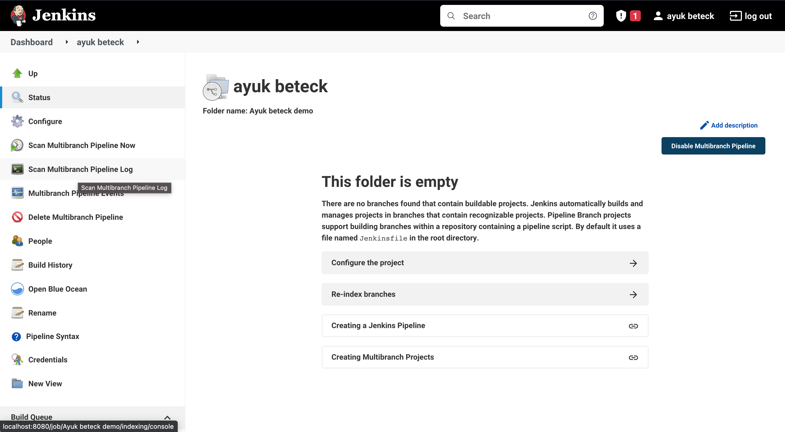
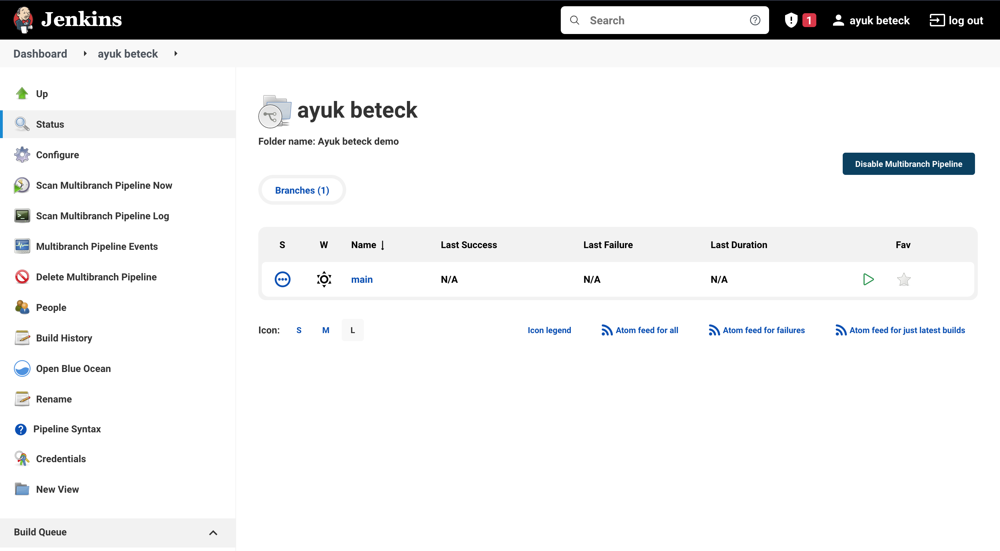
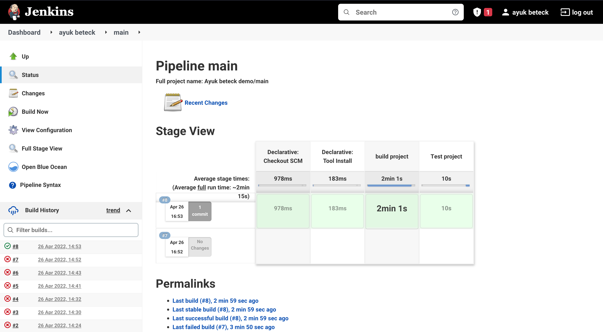
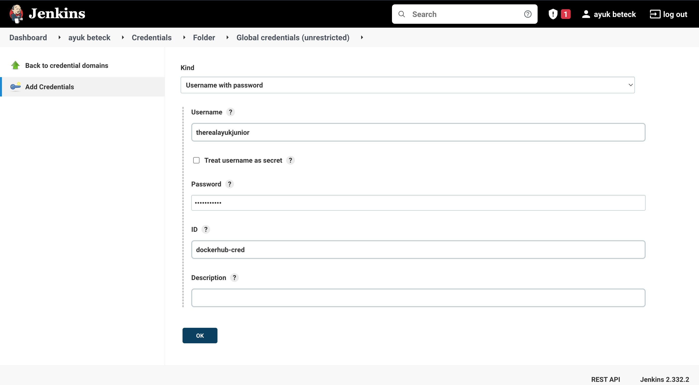
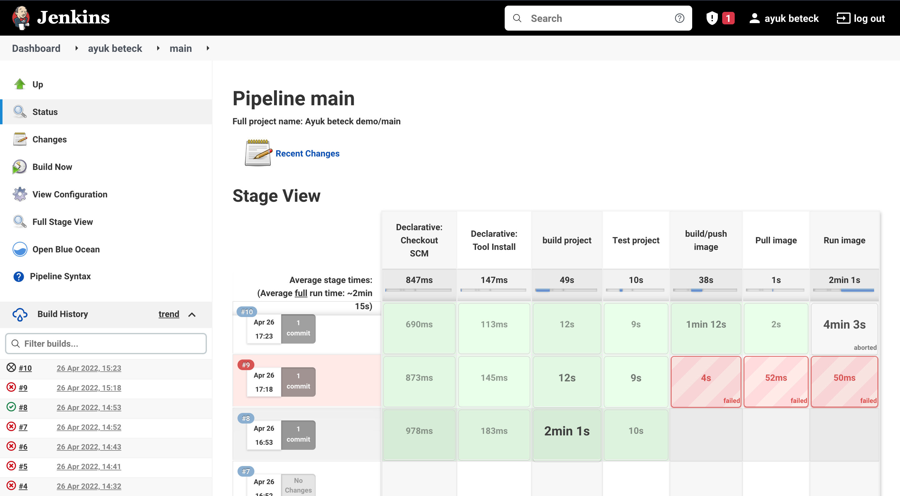
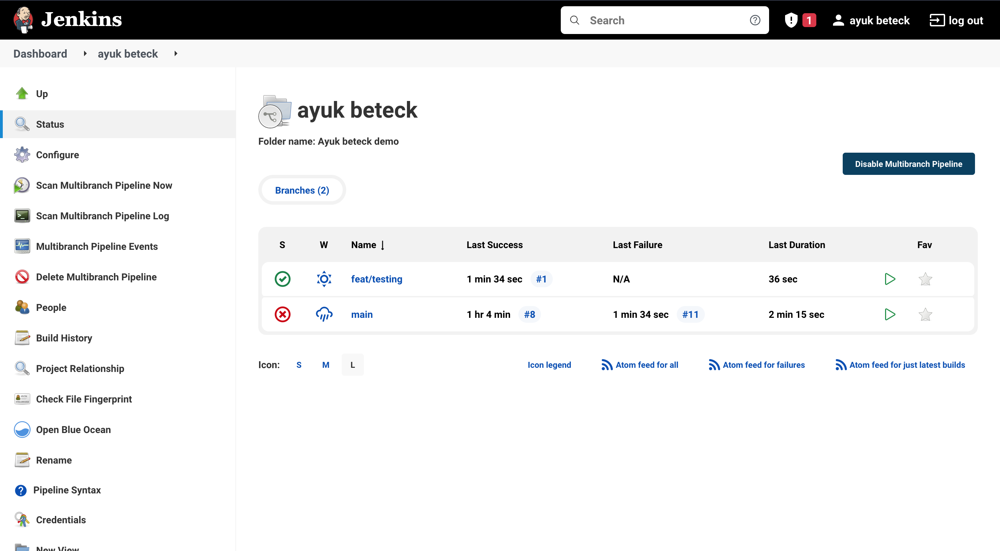
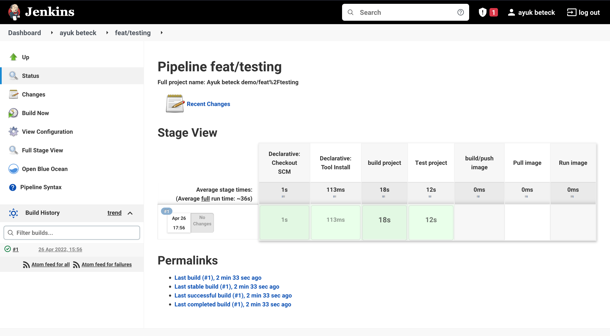

# Jenkins

## Jenkins setup

In order to run jenkins locally, we followed the official documentation on how to run jenkins
in docker image with docker in docker `https://www.jenkins.io/doc/book/installing/docker/`.
We can resume this by the following steps :

### Run jenkins docker image with DIND

First we create a network to host the jenkins in docker builder.

```
docker network create jenkins
```

The second thing is to run the docker builder image.

```
docker run --name jenkins-docker --rm --detach \
  --privileged --network jenkins --network-alias docker \
  --env DOCKER_TLS_CERTDIR=/certs \
  --volume jenkins-docker-certs:/certs/client \
  --volume jenkins-data:/var/jenkins_home \
  --publish 2376:2376 \
  docker:dind --storage-driver overlay2
```

And we create a dockerfile to create our costumazied jenkins image

```Dockerfile
FROM jenkins/jenkins:2.332.2-jdk11
USER root
RUN apt-get update && apt-get install -y lsb-release
RUN curl -fsSLo /usr/share/keyrings/docker-archive-keyring.asc \
  https://download.docker.com/linux/debian/gpg
RUN echo "deb [arch=$(dpkg --print-architecture) \
  signed-by=/usr/share/keyrings/docker-archive-keyring.asc] \
  https://download.docker.com/linux/debian \
  $(lsb_release -cs) stable" > /etc/apt/sources.list.d/docker.list
RUN apt-get update && apt-get install -y docker-ce-cli
USER jenkins
RUN jenkins-plugin-cli --plugins "blueocean:1.25.3 docker-workflow:1.28"
```

Now let's build our jenkins image.

```sh
docker build -t my-jenkins .
```

and the last step is to run the image.

```
docker run --name my-jenkins --rm --detach \
  --network jenkins --env DOCKER_HOST=tcp://docker:2376 \
  --env DOCKER_CERT_PATH=/certs/client --env DOCKER_TLS_VERIFY=1 \
  --publish 8080:8080 --publish 50000:50000 \
  --volume jenkins-data:/var/jenkins_home \
  --volume jenkins-docker-certs:/certs/client:ro \
  my-jenkins
```

We can access the jenkins instance using this url : `http://localhost:8080`


Now everything is setup for our lab.

## Project setup: springboot

For our project, we will generate a springboot project using: https://start.spring.io/

### Step 1:

First we will extract the generated project in our project folder. Then we will create a github repo and push the our source code to the version controller.

```
git init
git add .
git remote add origin git@github.com:XXXXXXX
git branch -M main
git push -u origin main

```

### Step 2:

In this step we will start creating our Jenkinsfile with just an `echo 'hello jenkins'` step.  
We can create the project using jenkins UI. Go to jenkins Dashboard > new item > chose multibranch pipeline (and give it a name ).


In the project settings we will need to setup for the momenent only **the Branch Sources** part with our github repo url.


### Step 3

Now everything is setup for jenkins, we will create our `Jenkinsfile` and push it to github. Next we will click on `Scan multibranch pipeline now`



As we can see for the moment we have only one branch


To see the build status we can click on the branch name



### Step 4

Now we had our pipeline with two steps build and test. we will add docker build step to build and push image to the docker hub

1- We create an account in the docker hub
2- we set the credentials as secret in jenkins UI. Go project dashboard > Credentials > Add credentials .



Then we update the jenkinsfile to add the build/push image to regitery . ( check the jenkinsfile)



### Step 5

To repect the build process we want to restrict the docker part only for the main branch . For this purpose we will create and add the condition in the Jenkinfile for docker part. (check the jenkinsfile).

```
when {
  branch 'main'
}
```

and let's create an other branch

```
git checkouot -b feat/test
git push origin feat/test
```

now let's rescan the pipeline branches. jenkins has detect the new branch as shown below.



and only the build and testing part of springboot has been executed.



### Final Step: Deploying to server

For this step we will need a server with an installed docker and ssh key.

For the deployment, we will invoke the `deploy.sh` from jenkins, it will be executed in the server using ssh connection. The script will pull the latest image from docker artifactory, stops the container if it is already working and runs it with latest version.

We will need to add the SSH key as text credentials (like we did in the step 4 with `remote_key` as credentials name).
