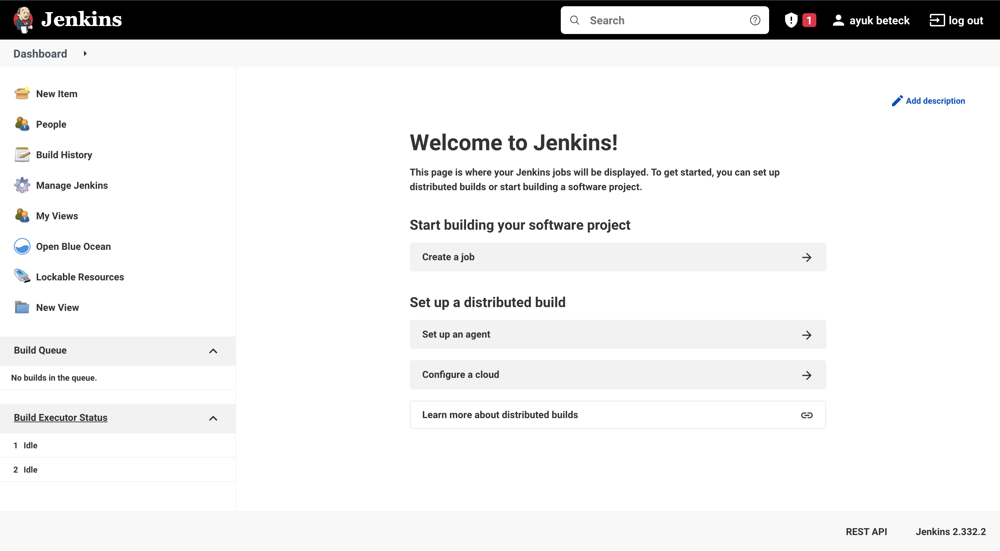
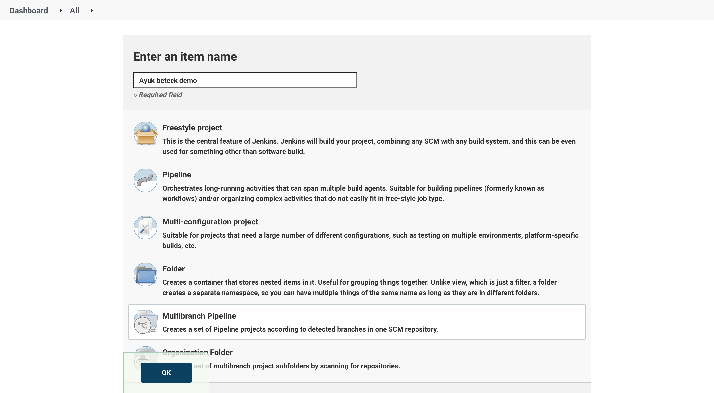
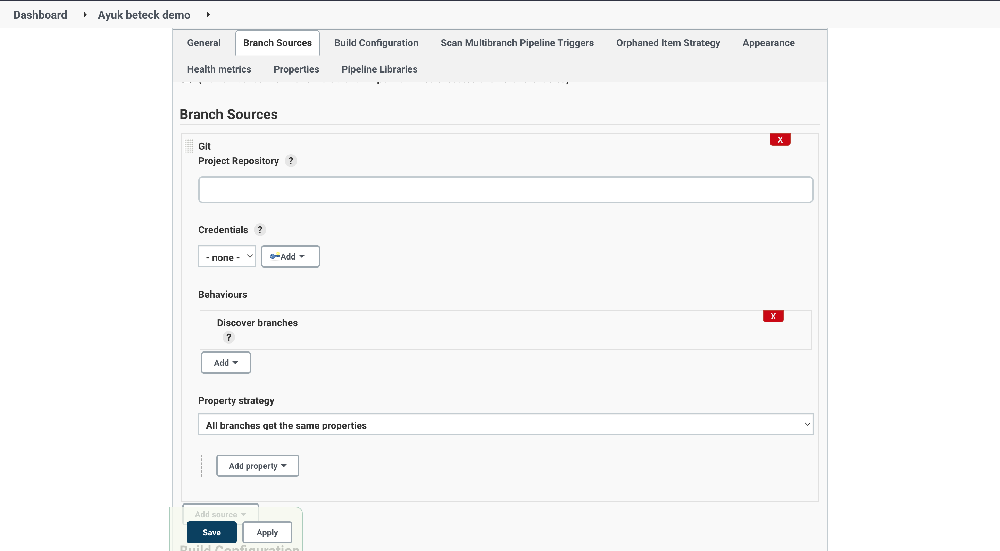

# Jenkins

## Jenkins setup

In order to run jenkins locally, we followed the official documentation on how to run jenkins
in docker image with docker in docker `https://www.jenkins.io/doc/book/installing/docker/`.
We can resume this by the following steps :

### Run jenkins docker image with DIND

First we create a network to host the jenkins in docker builder.

```
docker network create jenkins
```

The second thing is to run the docker builder image.

```
docker run --name jenkins-docker --rm --detach \
  --privileged --network jenkins --network-alias docker \
  --env DOCKER_TLS_CERTDIR=/certs \
  --volume jenkins-docker-certs:/certs/client \
  --volume jenkins-data:/var/jenkins_home \
  --publish 2376:2376 \
  docker:dind --storage-driver overlay2
```

And we create a dockerfile to create our costumazied jenkins image

```Dockerfile
FROM jenkins/jenkins:2.332.2-jdk11
USER root
RUN apt-get update && apt-get install -y lsb-release
RUN curl -fsSLo /usr/share/keyrings/docker-archive-keyring.asc \
  https://download.docker.com/linux/debian/gpg
RUN echo "deb [arch=$(dpkg --print-architecture) \
  signed-by=/usr/share/keyrings/docker-archive-keyring.asc] \
  https://download.docker.com/linux/debian \
  $(lsb_release -cs) stable" > /etc/apt/sources.list.d/docker.list
RUN apt-get update && apt-get install -y docker-ce-cli
USER jenkins
RUN jenkins-plugin-cli --plugins "blueocean:1.25.3 docker-workflow:1.28"
```

Now let's build our jenkins image.

```sh
docker build -t my-jenkins .
```

and the last step is to run the image.

```
docker run --name my-jenkins --rm --detach \
  --network jenkins --env DOCKER_HOST=tcp://docker:2376 \
  --env DOCKER_CERT_PATH=/certs/client --env DOCKER_TLS_VERIFY=1 \
  --publish 8080:8080 --publish 50000:50000 \
  --volume jenkins-data:/var/jenkins_home \
  --volume jenkins-docker-certs:/certs/client:ro \
  my-jenkins
```

We can access the jenkins instance using this url : `http://localhost:8080`



Now everything is setup for our lab.

## Project setup: springboot

For our project, we will generate a springboot project using: https://start.spring.io/

### Step 1:

First we will extract the generated project in our project folder. Then we will create a github repo and push the our source code to the version controller.

```
git init
git add .
git remote add origin git@github.com:XXXXXXX
git branch -M main
git push -u origin main

```

### Step 2:

In this step we will start creating our Jenkinsfile with just an `echo 'hello jenkins'` step.  
We can create the project using jenkins UI. Go to jenkins Dashboard > new item > chose multibranch pipeline (and give it a name ).



In the project settings we will need to setup for the momenent only **the Branch Sources** part with our github repo url.



### Step 3

Now everything is setup for jenkins, we will create our `Jenkinsfile`
